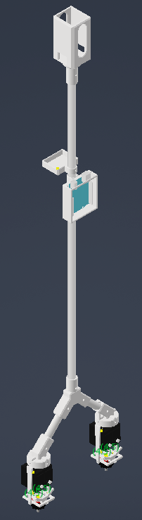
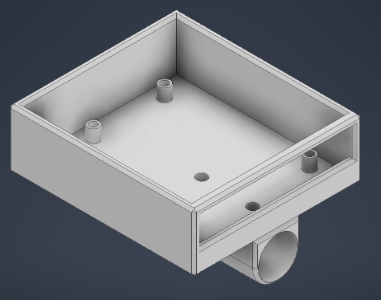
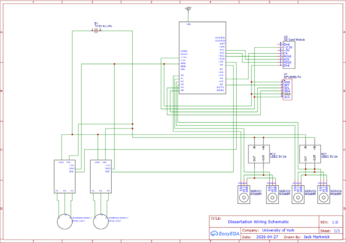
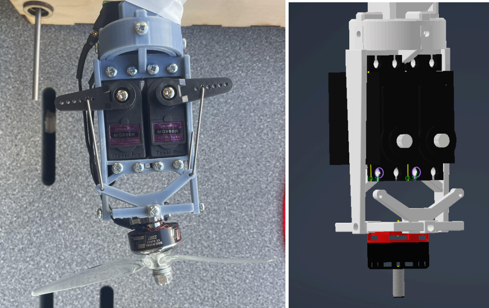

# Dual-Axis Thrust Vector Control (TVC) Flight System

> **BEng Dissertation Project — University of York (Grade: 75% / First-Class)**

## Abstract

Thrust Vector Control (TVC) is a method of manipulating the direction of propulsion of a vehicle by changing where the engine or exhaust is pointing to rotate a vehicle around its Centre of Mass (CoM). This project defines the development and usability of a cost-effective and lightweight alternative to the conventional thrust vectoring systems employed in industry, which rely on aerodynamic surfaces that become ineffective at low speeds. Throughout this project, the rocket was developed using 3D modeling, a gimballing system utilizing four servos to change the direction of two brushless motors, and structural containment mounted to an aluminum tube spine.

Flight software was developed in C++ to process real-time orientation data from an MPU6050 IMU through a PID controller, sending correctional signals to the servos to maintain a perpendicular angle to the ground. Experimental validation included determining motor deflection angles, restoring forces, and calculating the Moment of Inertia for pitch (0.167kgm^2) and roll (0.157kgm^2). This 6.12% discrepancy validated the independent PID variable gains. Under a static load of 2.5kg, the vehicle stabilized successfully, ultimately achieving unassisted free flight for approximately 5 seconds.

---

## Key Technical Specifications

* **Control Loop:** 100Hz non-blocking PID feedback loop running at 10ms intervals.
* **Actuation System:** Dual-axis gimbal driven by 4x MG996R high-torque servos utilizing custom 3D mixing logic.
* **Propulsion:** Twin Emax RSIII 2207 2500KV brushless motors driven by Skywalker 40A V2 ESCs powered by a 14.8V 4S LiPo battery.
* **Avionics & Logging:** Arduino Uno (ATmega328P) interfacing with MPU6050 6-DOF IMU and SPI Micro SD logging module capturing real-time telemetry.

---

## System Architecture & Hardware

### Complete Assembly & Avionics Housing
Custom-designed 3D-printed enclosures clamp directly to an aluminum tube spine, providing structural rigidity and shifting the Center of Mass (CoM) forward to optimize corrective torque.

| Full Airframe Build | Arduino & SD Card Enclosure |
| :---: | :---: |
|  |  |
| *Figure 1: Complete airframe with top-mounted battery.* | *Figure 2: Custom CAD housing with integrated SD bosses.* |

---

## Electrical & Wiring Architecture

To mitigate high-current motor spikes that caused initial logic rail failures, power isolation was implemented using a zero-shared-path strategy. The propulsion system draws from the primary 14.8V LiPo rail, while the Arduino logic and IMU are powered independently via a 9V supply to ensure maximum signal integrity.


*Figure 3: Electrical schematic showing power distribution rails, ESC modulation, and servo regulators.*

---

## Gimbal Kinematics & Static Load Testing

| 3D Gimbal Mechanism | Static Payload Test (2.5 kg) |
| :---: | :---: |
|  |  |
| *Figure 4: Universal joint assembly with side-by-side servo mounts.* | *Figure 5: Static load testing with 2.5 kg payload applied.* |

---

## Repository Structure

```text
├── TVC_Gimbal_Motor.ino    # Main 100Hz control loop & 3D mixing logic
├── PID_Controller.h        # Custom OOP PID class with output clamping
├── IMU.h                   # MPU6050 DMP register wrapper & Euler conversion
├── Logger.h                # Non-blocking SPI SD telemetry data logger
└── assets/                 # Schematics, CAD renders, and build photos
